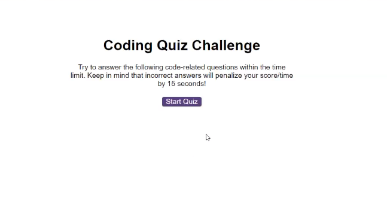

# Code-quiz

## Overview:
* Developer: Donna Thompson
* Challenge type: Create original code for a Code Quiz on JavaScript fundamentals

<br/>

## Link to deployed application:
[donnathompson7.github.io/Code-quiz](https://donnathompson7.github.io/Code-quiz)

<br/>
 
## Agile requirements:
### User Story

```
AS A coding boot camp student
I WANT to take a timed quiz on JavaScript fundamentals that stores high scores
SO THAT I can gauge my progress compared to my peers
```

### Acceptance Criteria

```
GIVEN I am taking a code quiz
WHEN I click the start button
THEN a timer starts and I am presented with a question
WHEN I answer a question
THEN I am presented with another question
WHEN I answer a question incorrectly
THEN time is subtracted from the clock
WHEN all questions are answered or the timer reaches 0
THEN the game is over
WHEN the game is over
THEN I can save my initials and my score
```

<br/>

## Screenshot of Code Quiz:

